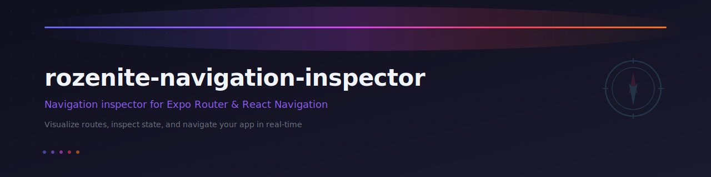

<p align="center">
  
</p>

# rozenite-navigation-inspector

A [Rozenite](https://github.com/callstackincubator/rozenite) DevTools plugin for inspecting navigation state in [Expo Router](https://docs.expo.dev/router/introduction/) / [React Navigation](https://reactnavigation.org/) apps.

Visualize your navigation tree, browse the sitemap, inspect route details, track navigation events, and navigate your app in real time directly from the Rozenite DevTools panel.

## Features

- **Real-time navigation tree**: See your full navigator hierarchy update live as you navigate
- **Sitemap view**: Browse all available routes from Expo Router's compile-time route tree, with visited-route tracking
- **Route details panel**: Inspect params, path, key, and navigator type for any selected node
- **Navigation timeline**: Chronological log of navigation events (push, pop, replace, tab-switch, etc.) with from/to route info
- **Navigation console**: Type a route path, pick an action (navigate / push / replace), pass JSON params, and go with autocomplete from all known routes
- **Route autocomplete**: Fuzzy-matched suggestions from the sitemap, navigation tree, and device route list combined
- **Dynamic route detection**: Sitemap highlights dynamic segments (`[id]`, `[...slug]`) with their parameter names
- **Resizable panels**: Drag handles between sidebar, tree, details, and timeline to customize the layout
- **URL scheme normalization**: Strips `mobile:///` prefixes and route groups from displayed paths
- **Debounced updates**: Uses `requestAnimationFrame` to batch rapid navigation state changes and avoid flooding the bridge
- **Production-safe**: The hook is replaced with a no-op in production builds, so no devtools code ships to users

## Prerequisites

- [Rozenite](https://github.com/callstackincubator/rozenite) integrated in your React Native project
- [Expo Router](https://docs.expo.dev/router/introduction/) >= 4.0.0 or [React Navigation](https://reactnavigation.org/) >= 7.0.0

## Installation

```bash
npm install -D rozenite-navigation-inspector
```

## Setup

### Expo Router

Add `useNavigationInspector` in your root layout, alongside your other Rozenite hooks:

```tsx
import { useNavigationInspector } from 'rozenite-navigation-inspector';

export default function RootLayout() {
  // Safe to call unconditionally — no-ops in production
  useNavigationInspector();

  return <Stack />;
}
```

Start with Rozenite enabled:

```bash
WITH_ROZENITE=true npx expo start -c
```

### React Navigation (without Expo Router)

Call `useNavigationInspector` where your `NavigationContainer` is rendered and pass the returned ref:

```tsx
import { NavigationContainer } from '@react-navigation/native';
import { useNavigationInspector } from 'rozenite-navigation-inspector';

function App() {
  // Returns a navigationRef to connect the inspector to your container
  const navigationRef = useNavigationInspector();

  return (
    <NavigationContainer ref={navigationRef}>
      {/* Your navigators */}
    </NavigationContainer>
  );
}
```

Start with Rozenite enabled:

```bash
WITH_ROZENITE=true npx react-native start
```

> **Note:** The hook auto-detects which router is available at runtime. If `expo-router` is installed it uses the Expo Router adapter with full sitemap and file-based routing support. Otherwise it falls back to a React Navigation adapter that works with state-based route discovery.

Open the Rozenite DevTools and you'll see a **Navigation Inspector** tab with your app's full navigation state.

## How It Works

The plugin has two parts that communicate over Rozenite's WebSocket bridge:

### React Native side (runs in your app)

The `useNavigationInspector` hook:

1. Connects to the Rozenite DevTools host via `useRozeniteDevToolsClient` from `@rozenite/plugin-bridge`
2. Auto-detects whether Expo Router or React Navigation is available and creates the appropriate adapter
3. Sends an initial snapshot of the navigation tree, active route, sitemap, and route list on mount
4. Subscribes to navigation state changes via `addListener('state', ...)`
5. On any state change, diffs the previous and current state to classify the event (push, pop, replace, tab-switch, etc.) and sends the updated tree + event to the panel
6. Responds to snapshot, sitemap, and route list requests from the panel
7. Handles `nav:navigate` messages from the panel to trigger navigation on the device
8. Debounces updates using `requestAnimationFrame` to prevent bridge flooding during rapid transitions
9. Cleans up all subscriptions on unmount

### DevTools panel (runs in the browser)

The panel renders inside the Rozenite DevTools as an iframe and:

1. Requests a full snapshot of the navigation tree, sitemap, and route list on mount
2. Listens for incremental `nav:tree-update` and `nav:event` events as navigation occurs
3. Displays a three-column layout: sitemap sidebar, navigation tree with route details, and a timeline
4. Provides a navigation console at the bottom for sending navigation commands to the device
5. All panels are resizable via drag handles

### Communication events

| Event | Direction | Description |
|-------|-----------|-------------|
| `nav:request-snapshot` | Panel -> App | Panel requests current navigation tree and active route |
| `nav:request-sitemap` | Panel -> App | Panel requests the app's sitemap |
| `nav:request-routes` | Panel -> App | Panel requests the list of all available routes |
| `nav:tree-snapshot` | App -> Panel | Full navigation tree snapshot with active route |
| `nav:tree-update` | App -> Panel | Incremental tree update after a navigation state change |
| `nav:event` | App -> Panel | Single navigation event (push, pop, replace, tab-switch, etc.) |
| `nav:sitemap` | App -> Panel | Full sitemap with route metadata and visit tracking |
| `nav:routes-list` | App -> Panel | List of all available route paths |
| `nav:navigate` | Panel -> App | Panel requests navigation to a path with optional params and action |

## API

### `useNavigationInspector()`

React hook that connects to the Rozenite DevTools and sends live navigation state updates. Safe to call unconditionally. In production, the hook is replaced with a no-op at the entry-point level, so no devtools code is bundled.

Returns a `navigationRef` that React Navigation users should pass to their `<NavigationContainer ref={navigationRef}>`. Expo Router users can ignore the return value.

The hook auto-detects the available router at runtime:
- **Expo Router**: Uses the Expo Router adapter with full sitemap, file-based routing, and `router.push/replace/navigate`
- **React Navigation**: Uses the React Navigation adapter with state-based route discovery and `CommonActions/StackActions`

### Types

```typescript
type NavigatorType = 'stack' | 'tabs' | 'drawer' | 'screen' | 'group'

type NavigationTree = {
  id: string
  type: NavigatorType
  name: string
  routeName?: string
  path?: string
  params?: Record<string, unknown>
  focused: boolean
  children: NavigationTree[]
}

type RouteInfo = {
  name: string
  path: string
  params: Record<string, unknown>
  key: string
  navigatorType: NavigatorType
}

type NavigationEventType =
  | 'push' | 'pop' | 'replace' | 'navigate'
  | 'tab-switch' | 'focus' | 'blur' | 'reset' | 'unknown'

type NavigationEvent = {
  id: string
  type: NavigationEventType
  timestamp: number
  fromRoute: RouteInfo | null
  toRoute: RouteInfo | null
  params?: Record<string, unknown>
}

type SitemapEntry = {
  path: string
  name: string
  isDynamic: boolean
  dynamicSegments: string[]
  hasBeenVisited: boolean
  lastVisited?: number
  children: SitemapEntry[]
}
```

### Adapter interface

The plugin uses a `NavigationAdapter` interface with two built-in implementations (`expo-router` and `react-navigation`):

```typescript
interface NavigationAdapter {
  name: string
  isAvailable(): boolean
  getTree(): NavigationTree | null
  getActiveRoute(): RouteInfo | null
  subscribe(cb: (event: NavigationEvent, tree: NavigationTree) => void): () => void
  navigate?(path: string, params?: Record<string, unknown>, action?: 'push' | 'navigate' | 'replace'): void
  getAllRoutes?(): string[]
  getSitemap?(): SitemapEntry[]
}
```

## Compatibility

| Dependency | Version | Required |
|------------|---------|----------|
| Rozenite | >= 1.3.0 | Yes |
| React Navigation | >= 7.0.0 | Yes |
| Expo Router | >= 4.0.0 | Optional |
| React Native | >= 0.70 | Yes |
| React | >= 18 | Yes |

## License

MIT
